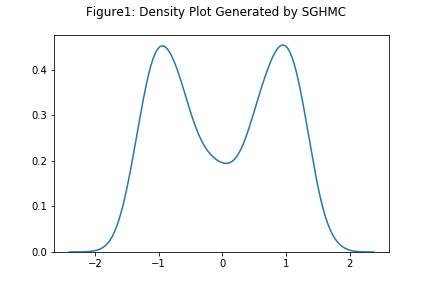
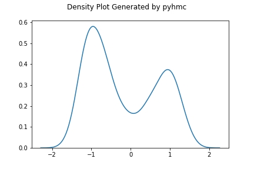
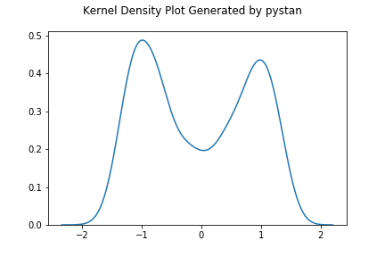
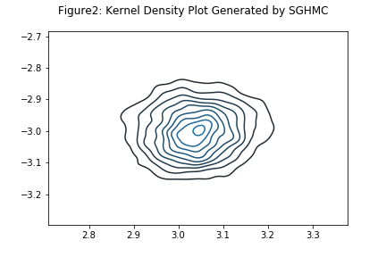
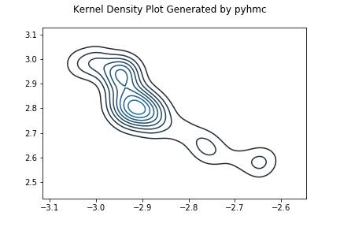
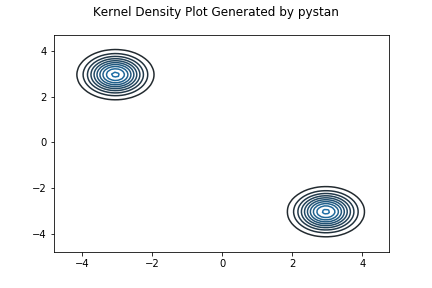
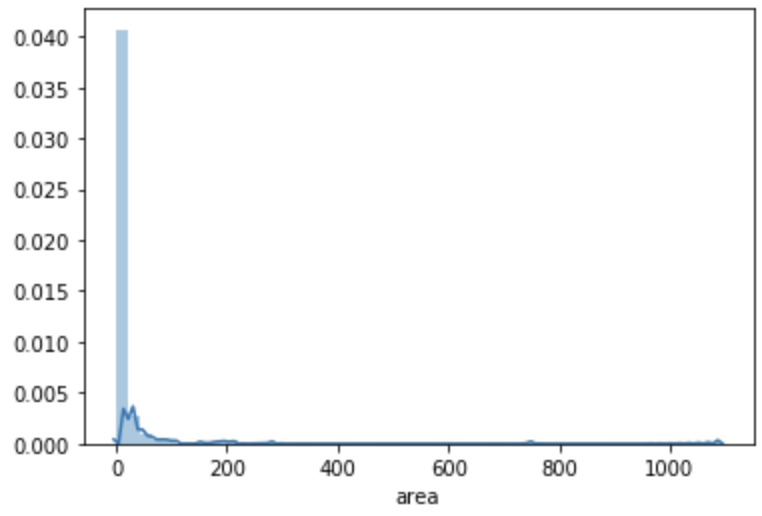
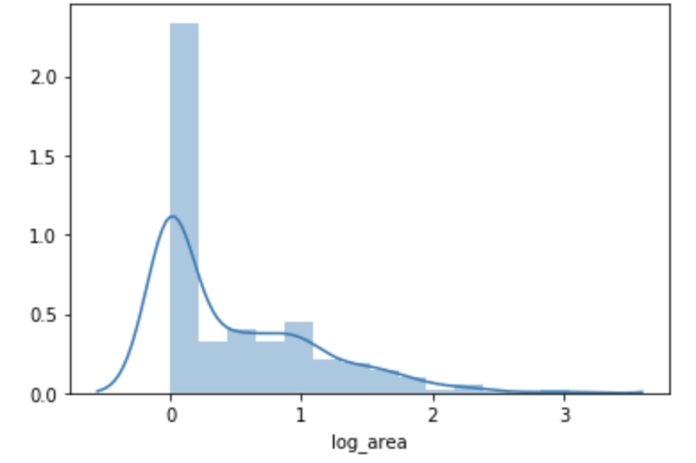
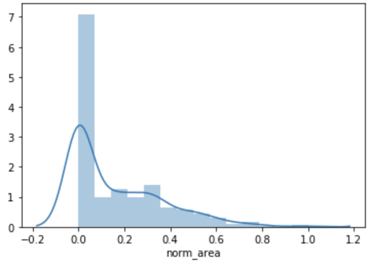
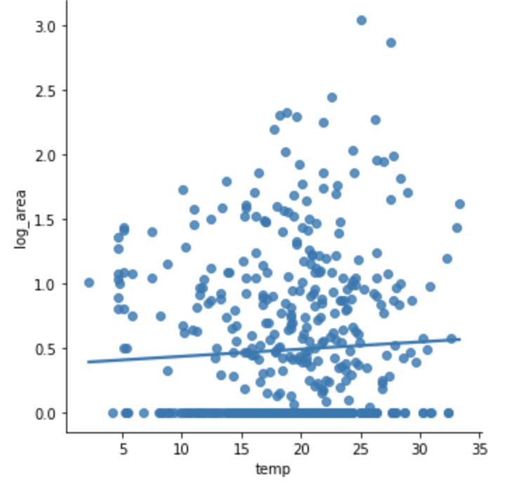

---
output:
  pdf_document: default
  html_document: default
---
# Implement Stochstic Gradient Hamiltonian Monte Carlo Using Python

### 
 Alicia Zhou, $\hspace{1mm}$Tao Ni 

## 1. Abstract

For this project, we implemented the Stochastic Gradient Hamiltonian Monte Carlo (SGHMC) algorithm described by Chen et al.(2014). This algorithm is a variant of traditional Hamiltonian Monte Carlo method, in which it utilizes the efficiencies of stochastic gradient and therefore allowing desired objective to be maintained even when friction is added. We optimized the algorithm utilizing package `numba` and Cholesky decomposition. Then we tested the algorithm based on two simulated examples and a real dataset and compare its performance to two other Monte Carlo methods using the Python package `Pyhmc` and `Pystan`. Codes are available on the GitHUb repository (https://github.com/azhou96/STA663-Final-Project-SGHMC) and the installation instructions are available in the `README.md` file.

key words: hamiltonian monte carlo, stochastic gradient, minibatch, simulation, Pystan, Pyhmc

## 2. Introduction

Hamiltonian Monte Carlo (HMC) algorithm is a MCMC algorithm which resides in Metropolis-Hastings framework. It is a methods that is often used to achieve desired proposals of distant states. HMC algorithm borrows its idea from physics – it defines the target distribution as potential energy as well as a kinetic energy term parametrized by momentum variables. HMC is especially advantageous in that it integrates the gradient information, allowing HMC to quickly explores the state space. This algorithm, however, contains limitation that a computation for simulation of the Hamiltonian dynamical system is required, which would be improbable to implement in data set with large sample size. Chen et al (2014) in their paper, provides us with a refined HMC, called Stochastic Gradient Hamiltonian Monte Carlo (SGHMC). In order to avoid such limitation, SGHMC utilizes stochastic gradient on minibatches of the dataset with noise and incorporates a friction term. This friction term will then be able to counteract with the introduced noise.

SGHMC can be especially useful when conditions required for traditional HMC are no longer obtainable. Such described situations include cases when samples have high correlation, or when the acceptance probabilities are low. In addition, the authors believe that a combination of HMC techniques and SGHMC will be applicable in significant scaling of Bayesian methods.

However, SGHMC also has its drawbacks. One limitation of SGHMC is that seven parameters need to be initialized before running this MCMC algorithm. Users will have to approximate these variables, leading to result being potentially deviated from proposed distribution. Another limitation of SGHMC is that the friction term is not available in practice. Therefore uncertainty occurs when we choose different methods to estimate the friction term.

## 3. Algorithm

To start with, we consider the basic HMC framework.
The Hamiltonian function is defined by
$$ H(\theta,r)=U(\theta)+\frac{1}{2}r^{T}M^{-1}r $$
where H measures the total energy of the system by adding position variable $\theta$ and momentum variable $r$.

U is defined as 
$$U(\theta)=-\sum_{x \in D}logp(x|\theta)-logp(\theta)$$
given that $p(\theta) \propto exp(-U(\theta))$ is the target posterior distribution.

We simulates samples from Hamiltonian Dynamics:
\begin{align*} 
d\theta &= M^{-1}rdt \\ 
dr &= -\nabla U(\theta)dt
\end{align*}

Then we move on to SGHMC. Instead of calculateing $-\nabla U(\theta)$ directly, SGHMC uses a  noisy estimate based on a uniformly sampled minibatch $\tilde{D}$ from D.

$$ \nabla \tilde{U}(\theta)=-\frac{|D|}{|\tilde{D}|}\sum_{x \in \tilde{D}}\nabla logp(x|\theta)-\nabla logp(\theta) $$

Now we apply Central Limit Theorem to this noisy gradient, and yield result as:

$$\nabla \tilde{U}(\theta) \approx \nabla U(\theta) + N(0,V(\theta))$$

Here $V(\theta)$ is the covariance of the stochastic gradient noise.
 
Using $\epsilon$-discretization, the noisy Hamiltonian dynamics becomes:

\begin{align*} 
d\theta&=M^{-1}rdt \\ 
dr&=-\nabla U(\theta)dt+N(0,2B(\theta)dt)
\end{align*}
where $B(\theta) = \frac{1}{2} \epsilon V(\theta)$

However, according to Corollary3.1, the distribution $\pi(\theta,r) \propto exp(−H(\theta,r))$ is no longer invariant under the noisy Hamiltonian dynamics. This causes problem that $\pi$ is no longer invariant and we will have to add a Metropolis-Hastings correction step, which is costly. Instead, SGHMC adds a friction term to modify the above stochastic differential equations:

\begin{align*} 
d\theta&=M^{-1}rdt \\ 
dr&=-\nabla U(\theta)dt-BM^{-1}rdt+N(0,2Bdt)
\end{align*}

For the sake of simplicity, we write $B(\theta)$ as B. The friction term $-BM^{-1}$ will decrease $H(\theta,r)$ -- thus reduce the effect of noise.

In practice, B is not available. Therefore we specify a friction term $C\succeq \hat{B}$ and rewrite the dynamics as:

\begin{align*} 
d\theta&=M^{-1}rdt \\ 
dr&=-\nabla U(\theta)dt-CM^{-1}rdt+N(0,2(C - \hat{B})dt)+N(0,2Bdt)
\end{align*}

There are two choices of $\hat{B}$:  
1) $\hat{B} = 0$  
2) $\hat{B} = \frac{1}{2} \epsilon \hat{V}$, where $\hat{V}$ is the empirical Fisher infromation

Our final algorithm is as followed: 

initialize $(\theta_0, r_0,\epsilon, M,\hat{B},B,C)$  
For t=1, 2, $\dots$  
$r^{(t)}\sim N(0, M)$ 
$(\theta_0, r_0) = (\theta^{(t)}, r^{(t)})=$  
$\quad$ For i=1,2 $\dots$  
$\quad$ $\theta_i=\theta_{i-1}+\epsilon M^{-1}r_{i-1}$ 
$\quad$ $r_i = r_{i-1} + \epsilon \Delta\tilde{U}(\theta_i)-\epsilon C M^{-1}r_{i-1}+N(0, 2(C-\hat{B})\epsilon)$  
$\quad$ end  
$\quad$ $(\theta^{(t+1)}, r^{(t+1)})=(\theta_m, r_m)$ 
end     

## 4. Optimization for Performance

To reimplement the Stochastic Gradient Hamiltonian Monte Carlo algorithm in the original paper, we implement the algorithm in a straightforward way directly from the description of the algorithm. The sghmc function takes a user defined gradient function, an initial guess, data and other parameters as specified in the algorithm. The algorithm will iterates over the samples and resample the momentum at each new iteration. As the sghmc algorithm is a MCMC sampler base, parallelization is not possible since the chains are dependent. Therefore, things we did to optimize the algorithm performance include (see `Optimization.ipynb` for details):
- We cleaned and reorganized the structure of the original version sghmc algorithm. For instance, we pre-calculate Cholesky decomposed covariance matrices needed to sample from the multivariate normal.
- JIT compilation to the main sghmc algorithm. During this process, we have tried the minibatch samples algorithm with and without JIT compilation and compared each of its performance together with the JIT version of sghmc.

We compared performances of four versions of our algorithm for both the simulated data set and the mixture of normal distributions, with $X \sim \frac{1}{2}N(\mu_1,1)+\frac{1}{2}N(\mu_2,1)$ and $\mu = (-3, 3)$. Details of those two examples such as parameter chosen will be described in the section below. However, just to test the efficiency of the algorithm, we reduced the number of iterations for each example. The performances are shown below:

|                               |  original  |cleaned version| numba@jit (main algorithm) | numba@jit (main algorithm and minibatch_data)
|:-----------------------------:|:----------:|:-------------:|:--------------------------:|:--------------------------:|
| Example 1                     | 832ms ± 8.56ms |  173ms ± 13.8ms |    166ms ± 4.39ms    |         206ms ± 3.4ms    |
| Example 2 (mixture of normals)| 5.46s ± 185ms  |  5.35s ± 184ms  |    5.31s ± 92.5ms    |         5.39s ± 176ms    |

From the above table we can see that there is a huge improvement when we applied Cholesky decomposition to pre-calculate the covariance matrices especially for example 1. Also, we noticed that when applied the JIT compilation to both the sghmc algorithm and the `minibatch_data` function, there is just a tiny improvement compared with the cleaned algorithm. However, when only applied the JIT comilation to the main sghmc algorithm, it performed better. Furthermore, compared two examples, the multivariate normal sampling takes longer than example 1. This expensive computation time is due to the auto-gradient calculation done by the jocobian function from autograd package. Thus, to improve the algorithm further, users should define the gradient functions.

## 5. Applications to Simulated Datas and Comparative Analysis

In this section, we applied the sghmc algorithm to two simulated data examples and compare its performance to both the standard HMC method implemented in the Python package `Pyhmc` and the `Pystan` package (a no U turn implement of HMC).

### Example 1

The first example is a reimplement of a known distribution that has already been discussed in the paper (Figure 1 on page 6). In Example 1, the true target distribution is $U(\theta)=-2\theta^2+\theta^4$. We use $\nabla{\tilde{U(\theta)}}=\nabla{U(\theta})+N(0,4)$ in our sghmc algorithm and $\epsilon=0.1$ in all cases. We also fixed our parameters as follows: $C=I(1)$, $V=I(1)*4$, `batch_size=5`, `number_of_iterations=5000` and `number_of_burn-in=200`, where $I(1)$ is the identity matrix.

Compared our implemented Figure1 to the Figure1 in the original paper, we can see that the density generated by sghmc using simulated data is very close to the true target distribution. This indicates that our algorithm performed well. Moreover, from the below two plots we can see that the simulation density generated by the Pystan is more similar to the density generated by sghmc compared to the Pyhmc result. This indicates that simulation results implmented by the Pystan package is closer to the true target distribution compared with the Pyhmc package. However, the density generated by Pyhmc is still similar to the original distribution, just not as good as the Pystan one.

### Example 2

The second example is sampling means from a mixture of normals. We defined $X \sim \frac{1}{2}N(\mu_1,1)+\frac{1}{2}N(\mu_2,1)$, where the true $\mu_1 = -3$ and $\mu_2 = 3$. We set the prior of both $\mu_1$ and $\mu_2$ as $N(0,10)$ and independent of each other. Also, we set $C$, $\hat{V}$, and $M^{-1}$ as identity matrix with learning rate $\epsilon = 0.01$, `batch_size=80`, `number_of_iterations=5000` and `number_of_burn-in=100`.

When we compare the density plot generated by sghmc with the two native libraries, Pystan performs better than the Pyhmc since it looks more similar to the density generated by sghmc.

Overall, from the above two examples, `Pystan` performed better than `Pyhmc`. This might because of the easy implmentation of the `Pystan` package. We only needs to specific the distribution and the data into the function. However, in order to implement the `Pyhmc` package, we need to specific some parameter alues. Inaccurate or unprceise inputs can lead to poor simulation performance. If the user could accurately specific all the parameters, `Pyhmc` could perform better than `Pystan`.

## 6. Applications to Real Datas

To apply the sghmc algorithm to real data set, we used the 'Forest Fires Data Set' extracted from the https://archive.ics.uci.edu/ml/index.php portal and try to fit a linear regression. The dataset contained 517 observations and 12 explanatory variables with the variable `area` as the response variable. In order to fit the linear regression, we chosen from the three predictors: `temp`, `RH`, `wind` and plot the pair-wise scatter plot to see their relationship with `area`. However, we noticed that the response variable `area` is very right-skewed towards zero, we log transformed the variable for further computation.

Since the majority of the values for the `area` variable are 0, the log transformation does not helped much. We also tried to normalize the varible, but the result is almost unchanged (see the above three plots). Therefore, we decided to use the `log10` base transformation for the variable `area`. From the below graph we can see that despite the variables of value 0, there appears to be a linear relationship between the `temp` and `area`. Thus, we used the sghmc algorithm to estimate the coefficients of the linear regression. However, the simulation results are all 'NAN'. This might because the sghmc algorithm is highly sensitive to the choice of tuning parameters and unstable.

## 7. Discussion

Through implementation and optimization of SGHMC algorithm, we can clearly see its advantages. SGHMC is a relatively efficient sampler, which can work on large data set. Optimization enhances its performance when we apply JIT to the algorithm alone. Beyond its efficiency, SGHMC also proves its accuracy in simulated samples. Compared to Pyhmc and Pystan, SGHMC provides us with results that are closer to the true distribution, which makes it a robust sampler.

However, SGHMC does not perform well on our real-world data set. Due to its reliance on accurate initialization of hyperparameters, SGHMC fails to yield a result from forestfire data set. Some other studies indicate that even when SGHMC yields result, the algorithm is unstable in producing valid distributions. Therefore SGHMC could not prove its robustness in real application where perfect setup is almost infeasible.

## References

[1] Chen, Fox, Guestrin."Stochastic Gradient Hamiltonian Monte Carlo." ICML, 2014.

[2] Khosla, Savya. “ML: Mini-Batch Gradient Descent with Python.” GeeksforGeeks, January 23, 2019.
